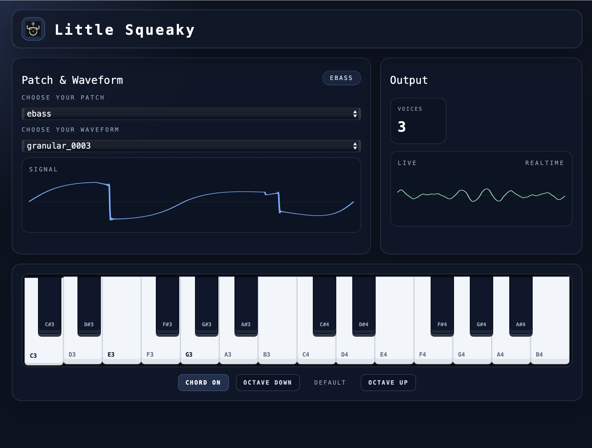

```
 ⡇ ⡇⢹⠁⢹⠁⡇ ⣏⡉ ⢎⡑⡎⢱⡇⢸⣏⡉⣎⣱⣇⠜⢇⢸
 ⠧⠤⠇⠸ ⠸ ⠧⠤⠧⠤ ⠢⠜⠣⠪⠣⠜⠧⠤⠇⠸⠇⠱ ⠇
 app
```

# Little Squeaky App

Little Squeaky is a desktop control interface for [Little Weirdo](https://github.com/hi-squeaky-things/little-weirdo), a Rust`no_std`-optimized synthesizer and sequencer for embedded devices. The application combines a Vue frontend with a Rust audio engine through Tauri, making it possible to explore sounds and play notes from a focused desktop interface.

The synthesizer supports additive, subtractive, granular, and sample-based sound design. Little Squeaky provides a visual way to select a sound source, inspect its waveform, monitor the generated output, and play the instrument from an on-screen keyboard.



Get the release (only macosx for now): [Prerelease Little Squeaky App V0.2.0](https://github.com/hi-squeaky-things/little-squeaky-app/releases#release-app-v0.2.0)

> [!CAUTION]
> This project is actively being developed with frequent breaking changes. APIs may shift, features are incomplete, and stability is not guaranteed. Use at your own risk and expect regular updates that might require code adjustments. Have fun!

> [!IMPORTANT]
> **Hi Squeaky Things** can happen at any time. _Little Weirdo_ is ready to squeak, squuuueak, squeeeeeaak, squeaaaaaaaaak!

## Features

- Select from the included waveform and sample bank.
- View the selected source waveform in the signal monitor.
- Monitor the live audio output in real time.
- Play a two-octave piano keyboard from C3 to B4.
- Hold the left mouse button and drag across keys to play continuously.
- Shift the keyboard up or down by octave.
- Use the bundled Bytesized font and local application assets without a font-network dependency.

## Quick Start

### Requirements

- Node.js and npm
- Rust and Cargo
- Tauri platform prerequisites for your operating system

Install the frontend dependencies:

```sh
npm install
```

Start the desktop application in development mode:

```sh
npm run tauri dev
```

Create a production build:

```sh
npm run tauri build
```

The frontend can also be checked independently with:

```sh
npm run build
```

## Project Structure

- `src/` contains the Vue interface and shared styles.
- `src-tauri/src/` contains the Rust audio engine and Tauri commands.
- `src-tauri/src/soundbank/` contains the bundled piano and waveform data.
- `src-tauri/icons/` contains the generated application icons.

## Contributing

Contributions are welcome! Please open an issue or submit a pull request.

## License

This project is licensed under the [MIT License](LICENSE).

## Releases

See https://github.com/hi-squeaky-things/little-squeaky-app/releases
